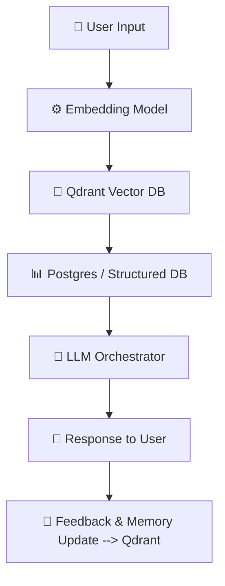
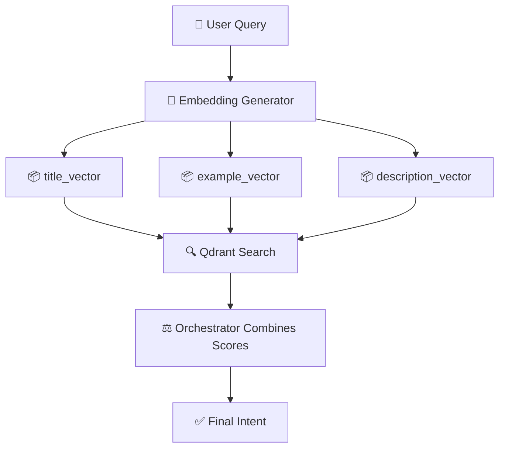

# 🚀 Qdrant in Agentic AI Projects

Qdrant acts as the **semantic memory** of an Agentic AI system.  
It stores embeddings of **knowledge, past interactions, and intents** so the AI can recall relevant information based on meaning — not just keywords.

---

## 🔹 1. Full Flow of Qdrant in Agentic AI



**Steps**:
1. **User Input** → Query
2. **Embedding Model** → Converts query into a vector
3. **Qdrant Search** → Retrieves similar knowledge/intents
4. **Structured DB (Postgres)** → Provides facts/transactions
5. **LLM Orchestrator** → Combines Qdrant + DB context
6. **Response** → Natural language back to the user
7. **Memory Update** → Store new embeddings into Qdrant

---

## 🔹 2. Advanced Intent Detection

Agentic AI uses **multi-method intent detection**:

| Method            | Speed  | Accuracy | Use Case | Example |
|-------------------|--------|----------|----------|---------|
| **Rule-Based**    | ⚡ ~5ms | 70-80%   | Exact matches | "book appointment" → `appointment_scheduling` |
| **Vector-Based**  | ⏱️ ~200ms | 85-90%   | Semantic similarity | "I need to schedule a meeting" → `appointment_scheduling` |
| **LLM-Based**     | ⏱️ ~200ms | 90-95%   | Context-heavy input | "My package hasn't arrived" → `order_management` |
| **Hybrid**        | 🌀 ~600ms | 92-97%   | Critical accuracy | Combines all 3 |

---

## 🔹 3. Approaches to Store Intents in Qdrant

- **Single Vector** → One embedding per intent
- **Multi-Vector** → Multiple embeddings per intent (title, examples, description)
- **Hybrid** → Vector search + metadata filters
- **Episodic Memory** → Store past user conversations
- **Domain-Specific Buckets** → Separate collections for each domain

---

## 🔹 4. Multi-Vector Representation

Multi-vector means **each point can hold multiple embeddings**.  
This is useful because queries can match different aspects (title, examples, or description).

### Example Schema
```ts
await qdrant.collections.create({
  collection_name: "intents",
  vectors: {
    title_vector: { size: 768, distance: "Cosine" },
    example_vector: { size: 768, distance: "Cosine" },
    description_vector: { size: 768, distance: "Cosine" }
  }
});
```

### Example Data
```ts
await qdrant.points.upsert("intents", {
  points: [
    {
      id: "appointment_scheduling",
      vectors: {
        title_vector: embTitle,
        example_vector: embExamples,
        description_vector: embDescription
      },
      payload: { intent: "appointment_scheduling", domain: "support" }
    }
  ]
});
```

---

## 🔹 5. Querying with Multi-Vectors

- **Single Vector Search**
```ts
qdrant.points.search("intents", {
  vector: { name: "example_vector", vector: queryEmbedding },
  limit: 5
});
```

- **Weighted Hybrid Search**
```ts
qdrant.points.search("intents", {
  query: [
    { name: "title_vector", vector: queryEmbedding, weight: 0.5 },
    { name: "example_vector", vector: queryEmbedding, weight: 1.0 },
    { name: "description_vector", vector: queryEmbedding, weight: 0.7 }
  ],
  limit: 5
});
```

---

## 🔹 6. Advantages of Multi-Vector Representation

✅ Richer representation → capture multiple perspectives  
✅ Robust matching → works for short, long, or noisy queries  
✅ Domain weighting → prioritize specific aspects dynamically  
✅ Multi-modal → combine text, audio, images together  

---

## 🔹 7. Example Flow: Intent Detection with Multi-Vector



---

# ✨ Summary

- **AI** = Brain (understands meaning & context)  
- **Vector DB (Qdrant)** = Memory (semantic recall)  
- **Hybrid Orchestration** = Strategy (chooses best path for intent detection)  
