# 🚀 Qdrant in Agentic AI Projects

Qdrant acts as the **semantic memory** of an Agentic AI system.  
It stores embeddings of **knowledge, past interactions, and intents** so the AI can recall relevant information based on meaning — not just keywords.

---

## 🔹 1. Full Flow of Qdrant in Agentic AI

```mermaid
flowchart TD
    A[🧑 User Input] --> B[⚙️ Embedding Model]
    B --> C[🧠 Qdrant Vector DB]
    C --> D[📊 Postgres / Structured DB]
    D --> E[🤖 LLM Orchestrator]
    E --> F[💬 Response to User]
    F --> G[📝 Feedback & Memory Update --> Qdrant]
```



**Steps**:
1. **User Input** → Query
2. **Embedding Model** → Converts query into a vector
3. **Qdrant Search** → Retrieves similar knowledge/intents
4. **Structured DB (Postgres)** → Provides facts/transactions
5. **LLM Orchestrator** → Combines Qdrant + DB context
6. **Response** → Natural language back to the user
7. **Memory Update** → Store new embeddings into Qdrant

---

## 🔹 2. Advanced Intent Detection

Agentic AI uses **multi-method intent detection**:

| Method            | Speed  | Accuracy | Use Case | Example |
|-------------------|--------|----------|----------|---------|
| **Rule-Based**    | ⚡ ~5ms | 70-80%   | Exact matches | "book appointment" → `appointment_scheduling` |
| **Vector-Based**  | ⏱️ ~200ms | 85-90%   | Semantic similarity | "I need to schedule a meeting" → `appointment_scheduling` |
| **LLM-Based**     | ⏱️ ~200ms | 90-95%   | Context-heavy input | "My package hasn't arrived" → `order_management` |
| **Hybrid**        | 🌀 ~600ms | 92-97%   | Critical accuracy | Combines all 3 |

---

## 🔹 3. Approaches to Store Intents in Qdrant

- **Single Vector** → One embedding per intent
- **Multi-Vector** → Multiple embeddings per intent (title, examples, description)
- **Hybrid** → Vector search + metadata filters
- **Episodic Memory** → Store past user conversations
- **Domain-Specific Buckets** → Separate collections for each domain

---

## **3.1 Single Vector Approach**
- **Concept**:  
  Each **intent** is stored as a **single embedding vector** (e.g., using the intent’s canonical name or description).  
  - Pros: Simple, easy to maintain.  
  - Cons: Limited representation (misses variety in phrasing).  

- **Realtime Example**:  
  Intent: *BookFlight*  
  - Store embedding for `"Book a flight"`  
  - Query `"I want to fly to New York"` → Should match `"BookFlight"` intent.

- **Node.js Example**:
```js
import { QdrantClient } from "@qdrant/js-client-rest";
import OpenAI from "openai";

const qdrant = new QdrantClient({ url: "http://localhost:6333" });
const openai = new OpenAI({ apiKey: process.env.OPENAI_API_KEY });

// Create collection
await qdrant.recreateCollection({
  collection_name: "intents",
  vectors: { size: 1536, distance: "Cosine" },
});

// Store single vector per intent
const embedding = await openai.embeddings.create({
  model: "text-embedding-3-small",
  input: "Book a flight"
});

await qdrant.upsert("intents", {
  points: [
    {
      id: 1,
      vector: embedding.data[0].embedding,
      payload: { intent: "BookFlight" }
    }
  ]
});

// Query
const queryEmbedding = await openai.embeddings.create({
  model: "text-embedding-3-small",
  input: "I want to fly to New York"
});

const result = await qdrant.search("intents", {
  vector: queryEmbedding.data[0].embedding,
  limit: 1
});

console.log(result);
```

---

## **3.2 Multi-Vector Approach**
## 🔹 Multiple Points per Intent

### Concept
Each intent can have **multiple embeddings** (title, description, training phrases).  
Each example is stored as a **separate point** in Qdrant.

- **Pros**: Better semantic coverage, simple to implement.  
- **Cons**: Larger storage, duplicate payloads, need post-processing to merge results.  

### Realtime Example
Intent: *BookFlight*  
- Title: "Book a flight"  
- Example: "Get me a ticket"  
- Example: "I need to travel tomorrow"

### Node.js Example
```js
const inputs = [
  "Book a flight", 
  "Get me a ticket", 
  "I need to travel tomorrow"
];

for (let i = 0; i < inputs.length; i++) {
  const emb = await openai.embeddings.create({
    model: "text-embedding-3-small",
    input: inputs[i]
  });

  await qdrant.upsert("intents", {
    points: [
      {
        id: `book_flight_${i}`, // unique per example
        vector: emb.data[0].embedding,
        payload: { 
          intent: "BookFlight", 
          phrase: inputs[i] 
        }
      }
    ]
  });
}
```

---

## 🔹 Single Point with Named Vectors

### Concept
Each intent is stored as **one point**, but with **multiple named vectors** (title, examples, description).  
Requires defining a **schema** with multiple vectors.

- **Pros**: Clean storage (one point per intent), consistent metadata.  
- **Cons**: Slightly more complex setup, must specify vector name in queries.  

### Example Schema
```ts
await qdrant.collections.create({
  collection_name: "intents",
  vectors: {
    title_vector: { size: 768, distance: "Cosine" },
    example_vector: { size: 768, distance: "Cosine" },
    description_vector: { size: 768, distance: "Cosine" }
  }
});
```

### Example Data
```ts
await qdrant.points.upsert("intents", {
  points: [
    {
      id: "book_flight", // single point for the intent
      vectors: {
        title_vector: embTitle,
        example_vector: embExample,
        description_vector: embDescription
      },
      payload: { 
        intent: "BookFlight", 
        domain: "travel" 
      }
    }
  ]
});
```

### Query Example
```ts
const queryEmb = await openai.embeddings.create({
  model: "text-embedding-3-small",
  input: "I need to book a flight to Paris"
});

// Search against a specific vector (e.g., example_vector)
const result = await qdrant.search("intents", {
  vector: queryEmb.data[0].embedding,
  limit: 1,
  using: "example_vector" // specify which vector to search on
});

console.log(result);
```

### Key Difference
- **Multiple Points per Intent** → Multiple **points** per intent (one per phrase).  
- **Single Point with Named Vectors** → One **point** per intent with multiple **named vectors**.  

Think of **Multiple Points** as “flattened examples” and **Single Point** as “structured schema”.

---

## **3.3 Hybrid Approach (Vector + Metadata Filters)**
- **Concept**:  
  Use **vector similarity** + **filters (metadata)** for higher precision.  
  - Pros: Combine semantic + structured search.  
  - Cons: More complex queries.  

- **Realtime Example**:  
  Query `"Find a hotel in Paris"` should match *HotelBooking* but filtered by `"domain": "travel"`.

- **Node.js Example**:
```js
// Create embedding for the intent "Book a hotel"
const hotelEmb = await openai.embeddings.create({
  model: "text-embedding-3-small",
  input: "Book a hotel"
});

// Upsert the intent into Qdrant with metadata
await qdrant.upsert("intents", {
  points: [
    {
      id: 101,
      vector: hotelEmb.data[0].embedding,
      payload: { 
        intent: "HotelBooking", 
        domain: "travel",
        category: "accommodation" 
      }
    }
  ]
});

// Create embedding for the user query
const queryEmbedding = await openai.embeddings.create({
  model: "text-embedding-3-small",
  input: "Find me a hotel in Paris"
});

// Search with vector + metadata filter
const result = await qdrant.search("intents", {
  vector: queryEmbedding.data[0].embedding,
  limit: 1,
  filter: {
    must: [
      { key: "domain", match: { value: "travel" } } // Filter by domain
    ]
  }
});

console.log(result);
```

---

## **3.4 Episodic Memory Approach**
- **Concept**:  
  Store **past user queries + system responses** as embeddings for contextual recall.  
  - Pros: Personalized interactions.  
  - Cons: Needs pruning/expiry for efficiency.  

- **Realtime Example**:  
  - User: `"I want to book a flight"`  
  - System: `"Where do you want to go?"`  
  - Store this as episodic memory → Next query `"To Paris"` will be interpreted in context.  

- **Node.js Example**:
```js
const memory = [
  { role: "user", content: "I want to book a flight" },
  { role: "assistant", content: "Where do you want to go?" }
];

for (let i = 0; i < memory.length; i++) {
  const emb = await openai.embeddings.create({
    model: "text-embedding-3-small",
    input: memory[i].content
  });

  await qdrant.upsert("episodic_memory", {
    points: [
      {
        id: Date.now() + i,
        vector: emb.data[0].embedding,
        payload: { role: memory[i].role, text: memory[i].content }
      }
    ]
  });
}
```

---

## **3.5 Domain-Specific Buckets**
- **Concept**:  
  Maintain **separate collections per domain** (e.g., Travel, Banking, Healthcare).  
  - Pros: Scalability, cleaner separation.  
  - Cons: Slightly harder cross-domain search.  

- **Realtime Example**:  
  - Collection `travel_intents` → `"BookFlight"`, `"HotelBooking"`  
  - Collection `banking_intents` → `"CheckBalance"`, `"TransferMoney"`

- **Node.js Example**:
```js
await qdrant.recreateCollection({
  collection_name: "travel_intents",
  vectors: { size: 1536, distance: "Cosine" }
});

await qdrant.recreateCollection({
  collection_name: "banking_intents",
  vectors: { size: 1536, distance: "Cosine" }
});

// Insert into travel collection
const travelEmb = await openai.embeddings.create({
  model: "text-embedding-3-small",
  input: "Book a flight"
});

await qdrant.upsert("travel_intents", {
  points: [
    { id: 1, vector: travelEmb.data[0].embedding, payload: { intent: "BookFlight" } }
  ]
});
```

---

## **📊 Comparison Table**

| Approach | Pros | Cons | Best Use Case |
|----------|------|------|---------------|
| **Single Vector** | Simple, fast, low storage | Poor coverage for phrasing variations | Small projects, baseline |
| **Multi-Vector** | Rich semantic coverage | More storage + compute | Conversational bots with varied phrasing |
| **Hybrid** | Combines semantic + filters | Query complexity | When metadata/domain filters are required |
| **Episodic Memory** | Personalized, context-aware | Needs memory management | Conversational agents with history |
| **Domain Buckets** | Scalable, clean separation | Harder cross-domain search | Multi-domain assistants |

---


# ✨ Summary

- **AI** = Brain (understands meaning & context)  
- **Vector DB (Qdrant)** = Memory (semantic recall)  
- **Hybrid Orchestration** = Strategy (chooses best path for intent detection)  
